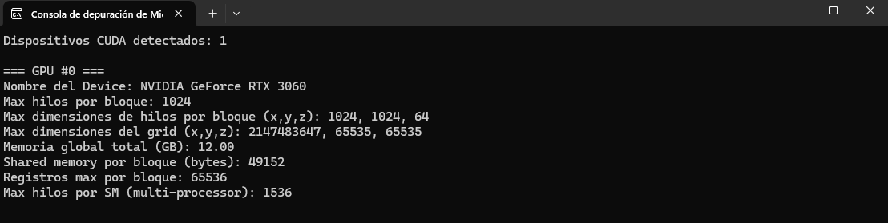

# Sesión 01 – Device Properties

En esta sesión se realiza una primera toma de contacto con el entorno CUDA,
centrándose en la obtención de las propiedades hardware del dispositivo gráfico
mediante la **CUDA Runtime API**.

## Objetivo
Obtener y analizar las características básicas de la GPU disponible en el sistema
utilizando la función `cudaGetDeviceProperties()`.

## Dispositivo utilizado
- **GPU**: NVIDIA GeForce RTX 3060
- **Arquitectura**: Ampere
- **Memoria global**: 12 GB

## Propiedades analizadas
- Nombre del dispositivo
- Número máximo de hilos por bloque
- Número máximo de hilos por SM
- Dimensiones máximas de hilos por bloque
- Dimensiones máximas del grid
- Memoria global disponible
- Memoria compartida por bloque
- Número máximo de registros por bloque

## Código fuente
El código utilizado para obtener estas propiedades se encuentra en la carpeta `src/`
y ha sido implementado en C/C++ utilizando CUDA.

## Conclusiones
El conocimiento de las propiedades del dispositivo es fundamental para diseñar kernels
CUDA eficientes, ya que permite ajustar la configuración de ejecución a las limitaciones
y capacidades reales del hardware.

